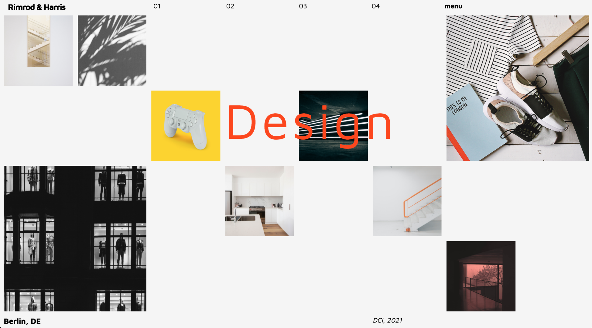

# Feminist Art Studio Homepage with Grid Layout

## Exercise Course-Module 1 - UserInterfaceBasics (UIB) - HTML/CSS

### Creation of a new homepage for the Feminist Art Dealer Studio, oriented to the mockup

(only desktop version, don't care about responsiveness for this task)

Used nested grid and _Maven Pro_ font from **Google Fonts**

01.10.22

### Image-Sources:

https://www.riseart.com/de/leitfaden/2418/alles-was-sie-ueber-feministische-kunst-wissen-muessen

https://roxanahalls.com/artwork/

item1: Roxana Hill, BeautyQueen, 2014
item2:Forbidden Fruit, 2015, von Alexandra Gallagher
item3:Pauline Bunny, 1997, von Sarah Lucas
item4: Do Women Have To Be Naked To Get Into the Met. Museum?, 1989, von Guerrilla Girls
item5:Barbara Kruger für AnOther Magazine,2004
item6: roxana_hill, Laughing While Leaving
item7: Stellar Baby, 2018, von Delphine Lebourgeois
item8: Bantu Embrace , 2017, von Mikela Henry-Lowe
item9: The Queens Daughter, 2017, von Irwanto Lentho
